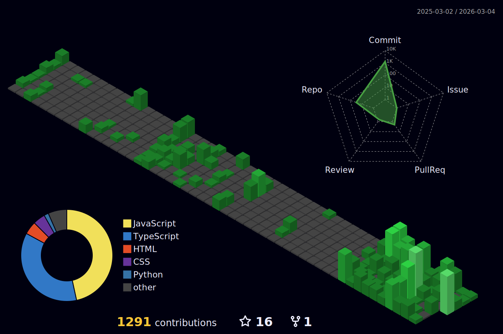

#  Hey, I'm Lokesh

 

  
  
  
  

 

---

### 👨‍💻 About Me

 

  <em>I am a Full-Stack Developer passionate about building products that solve real problems. My expertise lies in the <strong>MERN stack</strong> and integrating powerful <strong>AI models</strong> like Llama and Gemini into seamless, offline-first architectures. I love system design, reverse-engineering complex apps into open-source alternatives, and building tools that empower developers.</em>

---

### 🏆 Featured Projects

 

> _Every project here solves a real problem I personally experienced._

 

<!-- Row 1: AI Powerhouses -->
<table>
  <tr>
    <td width="50%" valign="top">
      <h3 align="center">🧠 CorteXia</h3>
      

        
        
      

      

        
        
        
        
      

      
<em>An AI-powered second brain & knowledge management system with voice input, persistent memory, and intelligent task automation — built for the Gemini API Developer Competition.</em>

    </td>
    <td width="50%" valign="top">
      <h3 align="center">🧬 DevIntel</h3>
      

        
        
      

      

        
        
        
        
      

      
<em>An AI-powered intelligence platform that decodes your GitHub DNA — transforming activity into insights, developer archetypes, and head-to-head battle comparisons.</em>

    </td>
  </tr>
  <!-- Row 2: Productivity -->
  <tr>
    <td width="50%" valign="top">
      <h3 align="center">🛡️ Second Brain</h3>
      

        
        
      

      

        
        
        
        
      

      
<em>An offline-first productivity vault with corruption-safe persistence, Pomodoro engine, and free cloud sync — born from losing years of focus data to paid apps.</em>

    </td>
    <td width="50%" valign="top">
      <h3 align="center">⌨️ ZenType</h3>
      

        
      

      

        
        
      

      
<em>A specialized typing tutor for Tamil <strong>Marutham</strong> layout and English, purpose-built to help students master keyboard proficiency for government exams.</em>

    </td>
  </tr>
  <!-- Row 3: Community & Automation -->
  <tr>
    <td width="50%" valign="top">
      <h3 align="center">🎭 MemeHub</h3>
      

        
      

      

        
        
        
        
      

      
<em>A community-driven social platform for sharing, discovering, and interacting with memes — complete with feeds, reactions, and user profiles.</em>

    </td>
    <td width="50%" valign="top">
      <h3 align="center">🤖 Automated WhatsApp Bot</h3>
      

        
      

      

        
        
      

      
<em>A backend automation tool for scheduling WhatsApp messages, designed for business loyalty programs and customer engagement workflows.</em>

    </td>
  </tr>
</table>

 

---

### 🛠️ Tech Stack & Tools

 

<table>
  <tr>
    <td align="center" valign="top" width="50%">
      
        
      
       
      
    </td>
    <td align="center" valign="top" width="50%">
      
        
      
       
      
    </td>
  </tr>
  <tr>
    <td align="center" valign="top" colspan="2">
       
      
        
      
    </td>
  </tr>
</table>

---

### 📊 GitHub Analytics

  

---

### 🏙️ 3D Contribution Calendar

---

### 🟡 Pacman Eating My Contributions

<picture>
  <source media="(prefers-color-scheme: dark)" srcset="https://raw.githubusercontent.com/itslokeshx/itslokeshx/output/github-contribution-grid-pacman-dark.svg" />
  <source media="(prefers-color-scheme: light)" srcset="https://raw.githubusercontent.com/itslokeshx/itslokeshx/output/github-contribution-grid-pacman.svg" />
  
</picture>

---

### 🤝 Let's Connect

 

_If you like what I build, consider giving a ⭐ to my repos — it means more than you think._
_I'm always open to collaborating on meaningful projects._

 

 

