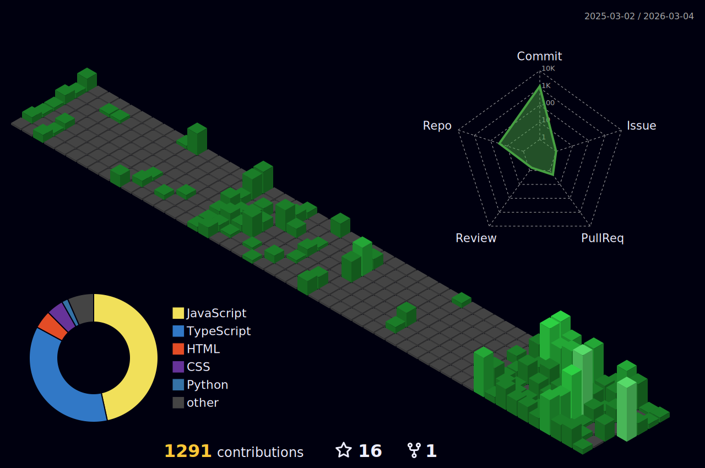

<!-- ============================================================
     LOKESH — GITHUB PROFILE README
     Builder Edition · Crafted for impact
     ============================================================ -->

<div align="center">

```
██╗      ██████╗ ██╗  ██╗███████╗███████╗██╗  ██╗
██║     ██╔═══██╗██║ ██╔╝██╔════╝██╔════╝██║  ██║
██║     ██║   ██║█████╔╝ █████╗  ███████╗███████║
██║     ██║   ██║██╔═██╗ ██╔══╝  ╚════██║██╔══██║
███████╗╚██████╔╝██║  ██╗███████╗███████║██║  ██║
╚══════╝ ╚═════╝ ╚═╝  ╚═╝╚══════╝╚══════╝╚═╝  ╚═╝
```

### I don't just write code. I build products.

<br/>

[](https://git.io/typing-svg)

<br/>


</div>

---

## `> whoami`

```yaml
name: Lokesh Kumar
role: Full Stack Developer & Product Builder
location: Tamil Nadu, India
stack: MERN · Next.js · TypeScript · AI/LLM Integration
philosophy: Every project should replace something you're paying for
superpower: Turning "I wish this existed" into production apps
currently: Building AI-first products and shipping open-source tools
```

> _I build products the way a craftsman builds furniture — every detail matters, every decision has a reason._
> _My repos aren't experiments. They're things people actually use._

---

## `> ls ./projects` — What I've Shipped

<br/>

### 🎵 SoulSync — _The Spotify Killer You Didn't Know You Needed_

<p align="left">
  <a href="https://github.com/itslokeshx/SoulSync">
    
  </a>
  <a href="https://soul-sync-beta.vercel.app/">
    
  </a>
  
</p>

<p align="left">
  
  
  
  
  
  
  
  
</p>

> Everything Spotify Premium charges ₹119/month for. **Free. Forever. Open-source.**

**What makes it different:**

- 🔍 **7-factor intelligent search engine** — originals always rank first, covers get buried
- 🤖 **AI playlist builder** (Groq LLaMA 3.3 70B) — describe a vibe, get 15 perfectly matched songs
- 🎧 **SoulLink** — real-time synchronized duo listening with in-session chat via Socket.io
- 📱 **Native Android APK** — same codebase, lock-screen controls, background audio, haptics
- ✈️ **True offline mode** — APK opens without login, music keeps playing
- 🔗 **Universal playlist import** — paste a Spotify/YouTube/Apple Music link, done
- ⚡ **96% faster search** with Redis caching — repeat queries return in under 50ms

```
Performance: Search latency 1.2s → 45ms │ Dashboard load 2.1s → 95ms │ Cache hit rate 78%
```

<br/>

---

### 🧠 CorteXia — _Your AI Second Brain_

<p align="left">
  <a href="https://github.com/itslokeshx/cortexia">
    
  </a>
  <a href="https://cortexia-two.vercel.app/">
    
  </a>
</p>

<p align="left">
  
  
  
  
</p>

> AI-powered knowledge management with voice input, persistent memory, and intelligent task automation. Built for the **Gemini API Developer Competition**.

<br/>

---

### 🧬 DevIntel — _Your GitHub DNA, Decoded_

<p align="left">
  <a href="https://github.com/itslokeshx/DevIntel">
    
  </a>
  <a href="https://dev-intel.vercel.app/">
    
  </a>
</p>

<p align="left">
  
  
  
  
</p>

> Transforms your GitHub activity into developer archetypes, insights, and head-to-head battle comparisons. Because your commits tell a story.

<br/>

---

### 🛡️ Second Brain — _Offline-First Productivity Vault_

<p align="left">
  <a href="https://github.com/itslokeshx/Second-Brain">
    
  </a>
  <a href="https://second-brain-hub.vercel.app/">
    
  </a>
</p>

<p align="left">
  
  
  
  
</p>

> Born from losing years of focus data to paid apps. Corruption-safe persistence, Pomodoro engine, free cloud sync — because your productivity data shouldn't be held hostage.

<br/>

---

### ⌨️ ZenType — _Master the Tamil Marutham Keyboard_

<p align="left">
  <a href="https://github.com/itslokeshx/ZenType">
    
  </a>
</p>

<p align="left">
  
  
</p>

> Purpose-built typing tutor for Tamil **Marutham** layout + English, designed to help students crack government exams. Local problem. Local solution.

<br/>

---

### 🎭 MemeHub & 🤖 WhatsApp Bot

<table>
<tr>
<td width="50%" valign="top">

**MemeHub** — Community-driven meme platform with feeds, reactions, and profiles. Full MERN stack.

<a href="https://github.com/itslokeshx/MemeHub"></a>

</td>
<td width="50%" valign="top">

**WhatsApp Bot** — Backend automation for scheduling messages. Built for business loyalty programs.

<a href="https://github.com/itslokeshx/Automated-whatsapp-message"></a>

</td>
</tr>
</table>

---

## `> cat tech_stack.json`

```json
{
  "frontend": [
    "React",
    "Next.js",
    "TypeScript",
    "Tailwind CSS",
    "Framer Motion",
    "Vite"
  ],
  "backend": ["Node.js", "Express", "Socket.io", "REST APIs", "WebSockets"],
  "database": ["MongoDB", "MySQL", "Redis (Upstash)", "IndexedDB"],
  "ai_ml": [
    "LLaMA 3.3 70B (Groq)",
    "Gemini AI",
    "Prompt Engineering",
    "NLP Pipelines"
  ],
  "mobile": ["Capacitor", "Android APK", "PWA"],
  "auth": ["Google OAuth 2.0", "JWT RS256", "httpOnly Cookies"],
  "devtools": ["Git", "GitHub Actions", "Postman", "VS Code", "Figma", "Linux"],
  "infra": ["Vercel", "Render", "MongoDB Atlas"],
  "other": ["Python", "PHP", "Electron"]
}
```

---

## `> git log --oneline` — How I Build

```
[philosophy]  Every project solves a real problem I personally faced
[approach]    System design first → prototype → ship → iterate in public
[obsession]   Performance metrics — if it's slow, it's broken
[values]      Open-source > paywalls. Always.
[pattern]     Reverse-engineer complex paid products into free alternatives
[secret]      The best products feel inevitable once you use them
```

---

## `> cat stats.md`

<div align="center">

<p>
  
</p>

<p>
  
  &nbsp;
  
</p>

</div>

---

## `> cat contribution_graph.svg`

<div align="center">



<picture>
  <source media="(prefers-color-scheme: dark)" srcset="https://raw.githubusercontent.com/itslokeshx/itslokeshx/output/github-contribution-grid-pacman-dark.svg" />
  <source media="(prefers-color-scheme: light)" srcset="https://raw.githubusercontent.com/itslokeshx/itslokeshx/output/github-contribution-grid-pacman.svg" />
  
</picture>

</div>

---

## `> connect --all`

<div align="center">

<br/>

<p>
  <a href="https://itslokeshx.vercel.app/">
    
  </a>
  &nbsp;
  <a href="https://www.linkedin.com/in/itslokeshx/">
    
  </a>
  &nbsp;
  <a href="https://x.com/itslokeshx">
    
  </a>
  &nbsp;
  <a href="https://dev.to/itslokeshx">
    
  </a>
  &nbsp;
  <a href="mailto:itslokeshx@gmail.com">
    
  </a>
</p>

<br/>

```
I'm always open to collaborating on products that make a real difference.
If you like what I build — drop a ⭐ on my repos. It fuels the next commit.
```

<br/>

[](https://git.io/typing-svg)

</div>


